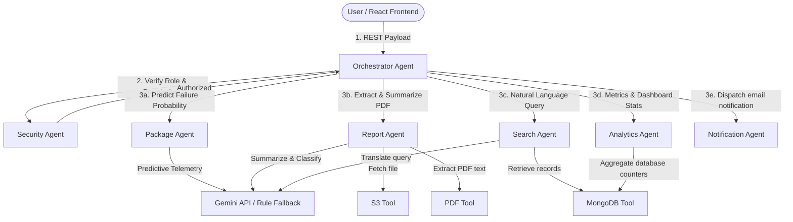

# MediPack AI: Multi-Agent Package Management & Clinical Ingestion System

> **A secure, resilient medical ingestion portal powered by a Multi-Agent coordination layer and Model Context Protocol (MCP) servers.**

MediPack AI evolved from the MediVault file upload system to provide healthcare organizations with an intelligent, resilient clinical document pipeline. It coordinates multiple specialized AI agents, supports standard Model Context Protocol (MCP) servers, and provides real-time predictive failure telemetry alongside a responsive, modern React dashboard.

---

## Table of Contents

- [1. Problem Statement](#1-problem-statement)
- [2. The Solution](#2-the-solution)
- [3. Multi-Agent Architecture](#3-multi-agent-architecture)
- [4. Model Context Protocol (MCP) Servers](#4-model-context-protocol-mcp-servers)
- [5. Security Hardening](#5-security-hardening)
- [6. Project Layout](#6-project-layout)
- [7. Installation & Setup](#7-installation--setup)
- [8. Running the Application](#8-running-the-application)
- [9. Verification & Testing](#9-verification--testing)

---

## 1. Problem Statement

Medical data ingestion suffers from two core technical challenges:
1. **Network Instability during Large File Ingestion**: Ingesting large diagnostic imaging files (DICOM, high-res CT scans, clinical PDFs) via typical browser channels frequently fails due to network drops, with no ability to resume.
2. **Disconnected Clinical Processing**: Once files arrive, doctors must manually open, categorize, and summarize reports. There is no automated categorization (e.g., distinguishing MRI vs. CT vs. Lab reports), no extraction of clinical insights, and no way to query medical databases using natural language.

---

## 2. The Solution

**MediPack AI** addresses these problems by providing:
* **Resumable Parallel Chunked Uploads**: Files are chunked in-browser (5–10 MB) and sent in parallel. Active upload telemetry monitors speed and predicts failure risk.
* **Specialized Multi-Agent Orchestration**: A central agent orchestrator directs specialized sub-agents to analyze, classify, search, and secure incoming data.
* **Low-Level MCP Servers**: Standardized interfaces exposing S3 storage, MongoDB, and local PDF files as reusable tools for LLM integration.
* **Clinical Summarization Modal**: Instantly extracts key clinical insights from medical PDFs using the Gemini API (with robust heuristic fallbacks).

---

## 3. Multi-Agent Architecture

MediPack AI uses a **hub-and-spoke multi-agent system** coordinated by a central orchestrator. All actions verify user permissions prior to routing.



### The Seven Specialized Agents
1. **OrchestratorAgent**: The single gateway. Verifies security context, delegates requests to sub-agents, and compiles responses.
2. **SecurityAgent**: Implements role-based access checks (authorizing only `doctor` and `admin` roles for clinical operations).
3. **PackageAgent**: Regulates package ingestion, stores metadata, and computes telemetry failure probability based on upload speed.
4. **ReportAgent**: Automates PDF fetching, extracts raw text content, and calls Gemini to categorize scans and generate summary summaries.
5. **SearchAgent**: Translates natural language queries (e.g. *"show completed MRI scans"*) into structured MongoDB filter criteria.
6. **AnalyticsAgent**: Monitors data volumes, calculates completed-to-pending metrics, and computes package success rates.
7. **NotificationAgent**: Logs audit events and sends mock email notifications to clinical personnel.

---

## 4. Model Context Protocol (MCP) Servers

Exposing database and system layers as standard Model Context Protocol (MCP) servers allows external developer tools (like Claude Desktop) to invoke them as native tools:

* **MongoDB MCP Server** (`mcp/mongodb_server.py`): Exposes database tools (`find_package`, `update_package`, `delete_package`).
* **S3 MCP Server** (`mcp/s3_server.py`): Exposes cloud tools (`upload_file`, `download_file`, `list_files`).
* **File MCP Server** (`mcp/file_server.py`): Exposes local file utilities (`read_pdf`, `extract_text`, `generate_metadata`).

---

## 5. Security Hardening

* **Fernet Symmetric Encryption**: AWS credentials stored in MongoDB are encrypted at rest using a symmetric key.
* **JWT Authenticated State**: Secure stateless access tokens with automatic refresh handling.
* **IP-Based Rate Limiting**: Implemented via `slowapi` to protect ingest endpoints.

---

## 6. Project Layout

```
package-system/
├── backend/                    # FastAPI Ingestion Engine
│   ├── database/
│   │   └── db.py               # MongoDB connections & TTL index registration
│   ├── models/
│   │   └── schemas.py          # Pydantic request/response validation schemas
│   ├── routers/
│   │   ├── auth.py             # Auth endpoints (Register, Login, Me)
│   │   ├── upload.py           # Resumable S3 upload lifecycle endpoints
│   │   └── agent.py            # Multi-agent POST /api/agent endpoint
│   ├── main.py                 # FastAPI configuration & middleware setup
│   ├── config.py               # Application settings manager
│   ├── encryption_utils.py     # Symmetric key Fernet utilities
│   ├── s3_client.py            # Low-level boto3 S3 multipart controllers
│   ├── mock_s3_service.py      # File-backed local S3 mock service
│   ├── validate_agent_flow.py  # Multi-agent flow validation suite
│   └── validate_mock_e2e.py    # Chunked upload mock lifecycle validation suite
│
├── agents/                     # AI Agent Layer
│   ├── orchestrator_agent.py   # Main router and security check dispatcher
│   ├── security_agent.py       # RBAC check handler
│   ├── package_agent.py        # Failure risk predictor
│   ├── report_agent.py         # PDF text summarizer & classifier
│   ├── search_agent.py         # Natural language translation agent
│   ├── analytics_agent.py      # Metrics aggregator
│   └── notification_agent.py   # Notification dispatcher
│
├── tools/                      # Ingestion Tools
│   ├── mongodb_tool.py         # DB CRUD helpers for agents
│   ├── s3_tool.py              # Cloud storage download/upload wrapper
│   ├── pdf_tool.py             # PDF text reader wrapper
│   └── gemini_tool.py          # Gemini REST client (with heuristic fallback rules)
│
├── mcp/                        # Model Context Protocol Servers
│   ├── mongodb_server.py       # MongoDB MCP Server
│   ├── s3_server.py            # S3 MCP Server
│   └── file_server.py          # File/PDF extraction MCP Server
│
└── frontend/                   # React Ingestion Dashboard
    ├── src/
    │   ├── api/
    │   │   ├── authApi.js      # Auth requests
    │   │   ├── uploadApi.js    # Chunked uploads controllers
    │   │   └── agentApi.js     # Orchestrator gateway requests
    │   ├── hooks/
    │   │   └── useChunkedUpload.js # Chunked transfer manager
    │   └── App.jsx             # Premium dashboard & UI controls
```

---

## 7. Installation & Setup

### Prerequisites
* Python 3.10+
* Node.js 18+
* MongoDB running locally (or via Docker Compose: `docker compose up -d mongo`)

### 1. Configure the Backend Environment
Create the configuration file:
```bash
cd backend
cp .env.example .env
```
Open `.env` and configure:
```env
USE_MOCK_S3=false            # Set to true to test S3 locally without real AWS credentials
MONGO_URI=mongodb://localhost:27017
MONGO_DB_NAME=medivault
JWT_SECRET_KEY=replace_with_a_strong_random_secret_at_least_32_chars_123456
ENCRYPTION_KEY=fearvzStwhCfiCaafOMMQdx211nzsfIuEpgyrvKlWGI=
GEMINI_API_KEY=your_gemini_api_key_here  # Leave empty to use local rule fallbacks
```

### 2. Install Backend Dependencies
```bash
python -m venv .venv
# On Windows:
.\.venv\Scripts\activate
# On Linux/macOS:
source .venv/bin/activate

pip install -r requirements.txt
```

### 3. Install Frontend Dependencies
```bash
cd ../frontend
npm install
```

---

## 8. Running the Application

### 1. Launch the Backend API
In the `backend/` folder (with virtual environment active):
```bash
python -m uvicorn main:app --reload --host 127.0.0.1 --port 8000
```

### 2. Launch the React Development Server
In the `frontend/` folder:
```bash
npm run dev
```
Open [http://localhost:5173](http://localhost:5173) in your browser. Register a new user, log in, configure a bucket, and begin uploading files with AI-driven summarization!

### 3. Run the MCP Servers (Optional)
To invoke the MCP servers using standard stdio transport:
```bash
python mcp/mongodb_server.py
python mcp/s3_server.py
python mcp/file_server.py
```

---

## 9. Verification & Testing

Verify both core features and the multi-agent routing using the test suites in `backend/`:

* **Multi-Agent E2E Integration Suite**:
  ```bash
  python validate_agent_flow.py
  ```
* **Chunked Ingestion & Recovery Suite**:
  ```bash
  python validate_mock_e2e.py
  ```
